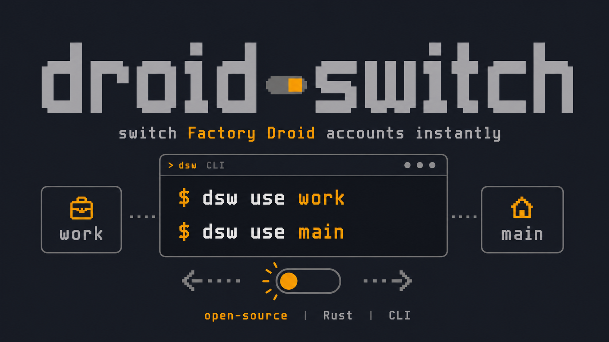

# Droid Switch



[English](README.md)

### 一个轻量的 Factory Droid 账号切换工具

[](https://github.com/hqman/droid-switch/releases)
[](https://github.com/hqman/droid-switch/releases)
[](LICENSE)
[](https://github.com/hqman/droid-switch/actions/workflows/ci.yml)

Droid Switch 是一个小型命令行工具，用来在多个 Factory Droid 账号之间切换。

它只切换 Droid 的认证文件。你的 sessions、history、settings 以及其他
`~/.factory` 数据都会保持共享。

## 为什么需要 Droid Switch？

Factory Droid 会把登录状态保存在本地。如果你使用多个账号，通常需要反复退出、
重新登录，或者手动移动认证文件。

Droid Switch 会把每个登录状态保存成一个命名 profile。切换账号时，它只复制认证
文件包。

- 不需要手动复制文件。
- 不需要为每个账号维护单独的 `~/.factory` 目录。
- 不会修改 sessions、history 或 settings。
- 每次切换前都会自动备份。

## 功能

- 将当前 Droid 登录状态保存为命名 profile。
- 启动 Droid 并自动捕获新的登录状态。
- 在已保存的 profile 之间切换，不需要每次重新认证。
- 在可用时列出 profile 的账号邮箱和 token 过期时间。
- 如果切换有误，可以恢复自动备份。
- 支持 macOS Apple Silicon、Linux 和 Windows。

## 安装

macOS 和 Linux：

```sh
curl -fsSL https://raw.githubusercontent.com/hqman/droid-switch/main/install.sh | sh
```

Windows PowerShell：

```powershell
iwr https://raw.githubusercontent.com/hqman/droid-switch/main/install.ps1 -UseB | iex
```

安装脚本会下载最新的 GitHub Release，并安装到用户本地的二进制目录。可以设置
`DSW_VERSION`、`DSW_REPO` 或 `DSW_INSTALL_DIR` 来覆盖默认版本、仓库或安装位置。

你也可以直接从
[Releases](https://github.com/hqman/droid-switch/releases) 页面下载二进制文件。

Rust 用户可以从 crates.io 安装：

```sh
cargo install droid-switch
```

## 快速开始

如果你已经登录了 Droid，先保存当前账号：

```sh
dsw import main
```

添加另一个账号：

```sh
dsw add work
```

这会打开 Droid。请在浏览器里登录另一个账号，Droid Switch 会自动保存它。

随时切换账号：

```sh
dsw use main
dsw use work
```

查看 profile：

```sh
dsw list
dsw status
dsw sync
dsw sync --all
```

## 命令

```text
dsw init [--import-as <name>]   创建存储目录，并可选择导入当前登录状态
dsw import <name> [--force]     将当前 live 登录状态保存为 profile
dsw add <name> [--no-login]     启动 Droid，等待登录，然后保存
dsw use <name>                  激活一个已保存的 profile
dsw list [--json]               列出已保存的 profile
dsw status [--json]             显示当前激活的 profile 和 live 身份
dsw sync [--all]                将 live auth 保存回 profile
dsw remove <name> [-y]          删除 profile
dsw rename <old> <new>          重命名 profile
dsw doctor [--json]             检查路径、权限、Droid 和 token
dsw backup list                 列出自动备份
dsw backup restore <id> [-y]    恢复备份
dsw backup prune [--keep <n>]   只保留最新的若干备份
```

Profile 名称长度必须为 1 到 64 个字符，并且只能包含小写 ASCII 字母、数字、
`-` 和 `_`。

## 数据存储

Droid Switch 默认使用这些路径：

```text
~/.factory/                     Live Factory Droid 配置目录
~/.dsw/profiles/<name>/         已保存的 profile 认证文件
~/.dsw/backups/<id>/            自动切换备份
~/.dsw/state.json               当前激活 profile 的状态
```

它只复制这些文件：

- `auth.v2.file`
- `auth.v2.key`
- `auth.encrypted`

`~/.factory` 里的其他内容都不会被修改。

## 安全

- 已保存的 profile 和备份包含本地认证材料。
- 不要在 issue 或日志里分享 `~/.factory` 或 `~/.dsw` 文件。
- 在 Unix-like 系统上，Droid Switch 会为存储目录和复制的认证文件设置私有权限。
- 如果切换行为异常，请运行 `dsw doctor`。

## FAQ

### 它会修改我的 Droid sessions 或 settings 吗？

不会。它只复制上面列出的认证文件。

### 我可以切回当前正在使用的账号吗？

可以。先用 `dsw import <name>` 保存当前账号，然后就可以用
`dsw use <name>` 切回它。

### 切换前会发生什么？

Droid Switch 会在 `~/.dsw/backups` 下备份当前 live 认证文件。

### 如何保存 Droid 刷新后的 token？

Droid 可能会刷新 `~/.factory` 里的当前 live 登录状态。使用 Droid 后，运行
`dsw sync` 可以把刷新后的认证文件包保存回当前激活的 profile。

使用 `dsw sync --all` 可以把当前 live 认证文件包保存到所有 decoded email 或
subject 相同的已保存 profile。这个操作是刻意保持安全的：它不会切换账号，不会
启动 Droid，也不会刷新其他账号。

### 可以使用自定义配置目录吗？

可以。设置 `DSW_HOME` 可以修改 Droid Switch 的存储目录，设置 `FACTORY_DIR`
可以修改 live Droid 配置目录。

## 从源码构建

安装 Rust 1.80 或更新版本，然后运行：

```sh
cargo build --release
```

运行检查：

```sh
cargo fmt --check
cargo clippy --locked --all-targets -- -D warnings
cargo test --locked
```

## 发布

创建并推送版本 tag：

```sh
git tag v0.1.0
git push origin v0.1.0
```

GitHub Actions 会发布 macOS、Linux 和 Windows 的预构建二进制文件。

## 贡献

欢迎提交 issue 和 pull request。提交 pull request 前，请先运行上面的检查。

## 许可证

MIT。见 [LICENSE](LICENSE)。
